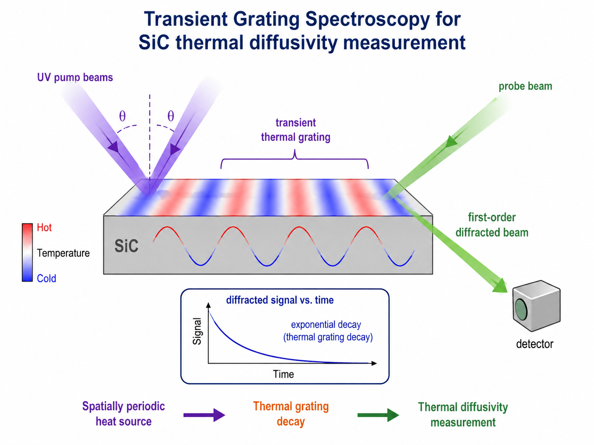
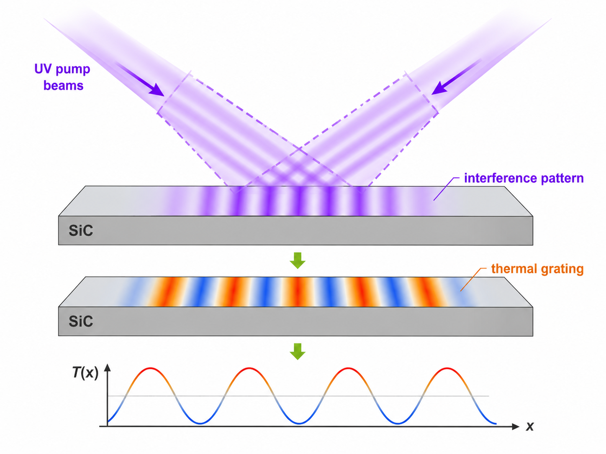
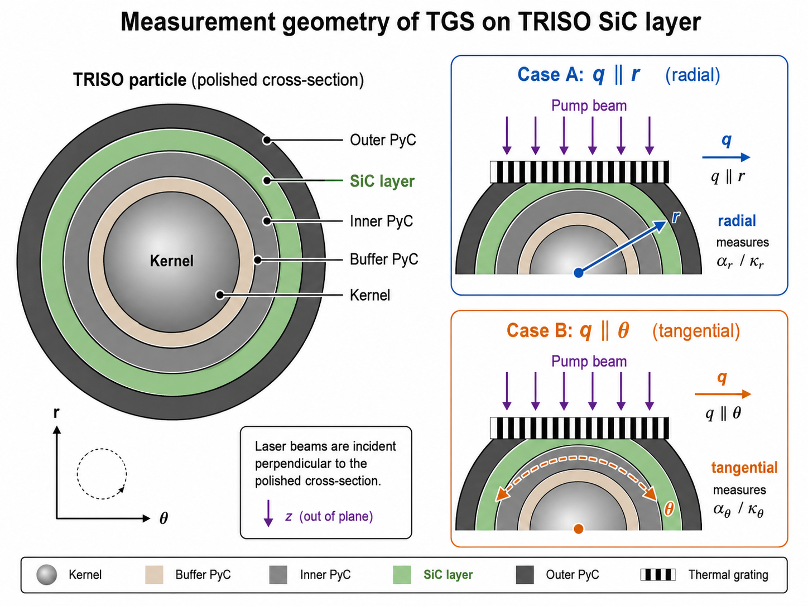
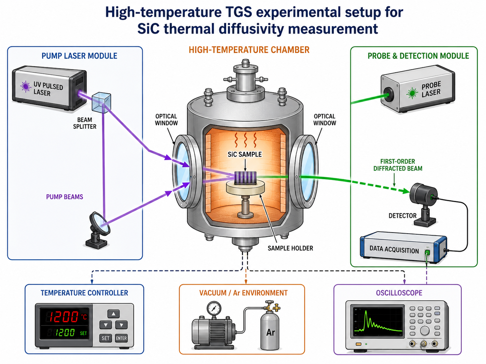
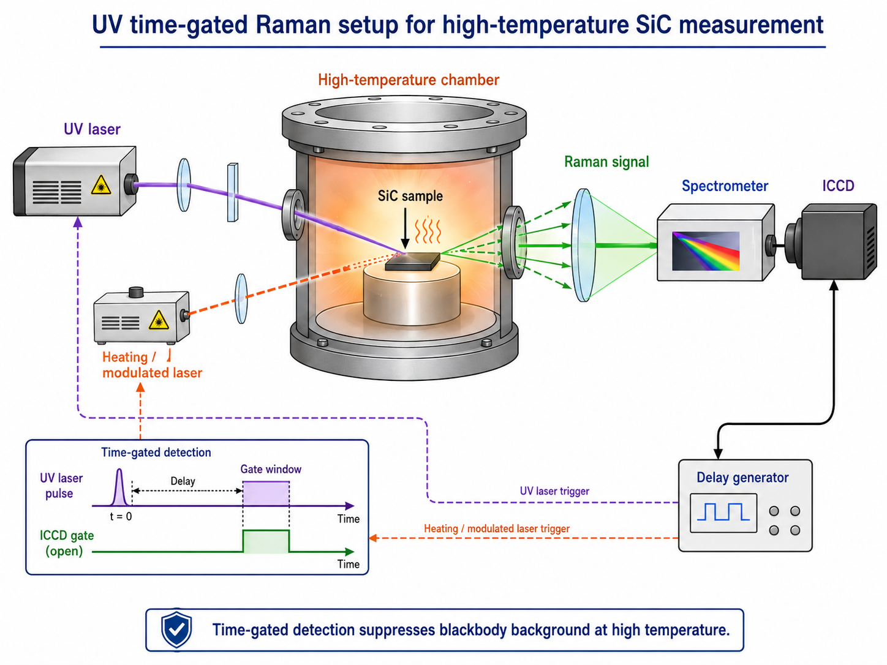
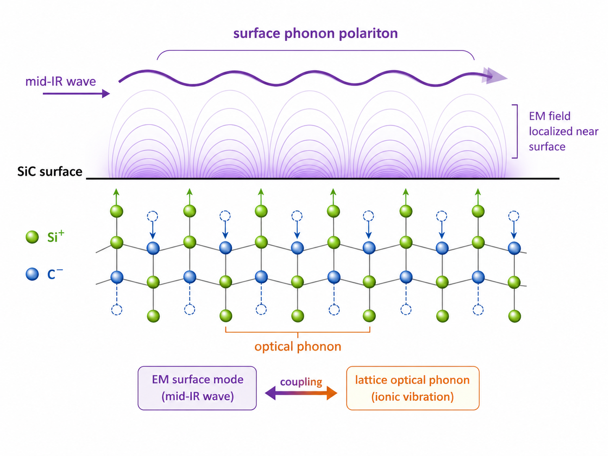
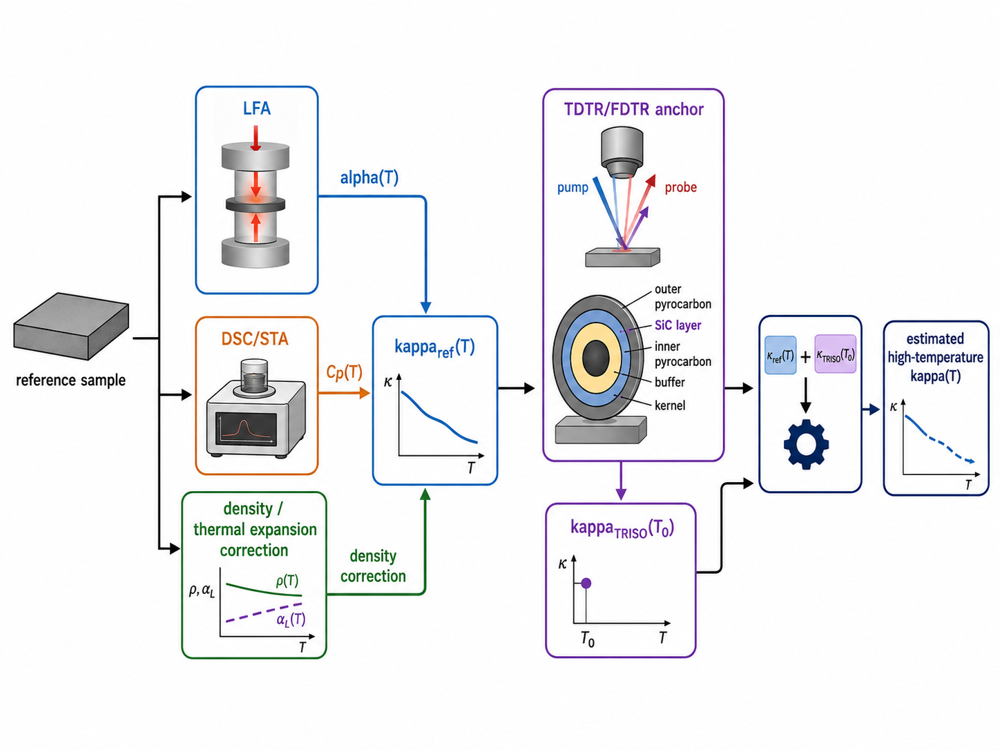

# 高温条件下 TRISO SiC 层本征热导率测量方案讨论

## TGS 主攻路线、UV 时间门控 Raman 辅助验证、SiC 声子热谱与传统保底方案

  组会技术讨论
  SiC thermal conductivity measurement

---

# 方案一：TGS 瞬态热光栅法

## 高温 SiC 本征热导率的主攻路线

- **非接触、无涂层、局域、可调长度尺度**的光热测量方法
- 两束相干泵浦光在 SiC 表面形成空间周期热源
- 探测热光栅衰减，直接获得热扩散率

$$
\alpha(T)\ \longrightarrow\ \kappa(T)=\alpha(T)\rho(T)C_p(T)
$$

TGS 的核心优势不是“更成熟”，而是它的物理量与几十微米 SiC 层问题更匹配。

---

# TGS 底层物理：周期热源的形成

两束相干 UV 泵浦光在样品表面干涉：

$$
I(x)=I_0[1+\cos(qx)]
$$

光栅波矢与周期为：

$$
q=\frac{2\pi}{\Lambda},
\qquad
\Lambda=\frac{\lambda_p}{2\sin\theta}
$$

SiC 吸收泵浦能量后形成初始温度扰动：

$$
T(x,z,0)=T_b+\Delta T_0 e^{-z/\delta_{\rm abs}}\cos(qx)
$$

$\Lambda$ 是实验中可主动调控的空间尺度；$q$ 决定热扩散的主方向。

---

# 热光栅衰减：从时间常数得到 $\alpha$

热扩散方程：

$$
\frac{\partial T}{\partial t}=\alpha \nabla^2T
$$

若初始温度场中包含 $\cos(qx)$，则热光栅衰减为：

$$
\Delta T(x,t)=\Delta T_0 e^{-\alpha q^2 t}\cos(qx)
$$

因此热扩散率满足：

$$
\tau=\frac{1}{\alpha q^2},
\qquad
\alpha=\frac{1}{q^2\tau}
$$

探测一阶衍射强度时：

$$
I(t)\propto e^{-2\alpha q^2t}
$$

TGS 测的不是绝对温度，而是“周期性温度起伏消失的速度”。

---

# 多光栅周期：判断是否为真实扩散过程

建议不要只测一个 $\Lambda$，而是测多个周期：

$$
\Lambda=5,\ 10,\ 15,\ 20,\ 30\ \mu{\rm m}
$$

对每个周期得到衰减率：

$$
\Gamma=\frac{1}{\tau}
$$

理想扩散控制下：

$$
\Gamma=\alpha q^2
$$

### 判据

- $\Gamma$ 与 $q^2$ 线性良好：扩散模型成立
- 偏离线性：可能存在有限厚度效应、界面影响、表面损伤或准弹道输运
- 多 $\Lambda$ 是 TGS 相比单曲线 LFA 的信息优势

### 建议输出图

$$
\Gamma \ \text{vs.}\ q^2
$$

线性斜率：

$$
\alpha=\frac{d\Gamma}{d(q^2)}
$$

---

# 从 $\alpha$ 到 $\kappa$：完整物性链条

TGS 直接得到的是热扩散率：

$$
\alpha(T)
$$

热导率需要进一步计算：

$$
\kappa(T)=\alpha(T)\rho(T)C_p(T)
$$

其中：

- $C_p(T)$：由 DSC / STA 测量
- $\rho(T)$：由室温密度与热膨胀修正
- $\alpha(T)$：由 TGS 衰减拟合获得

密度修正可写为：

$$
\rho(T)=
\frac{\rho_0}
{1+3\int_{T_0}^{T}\beta(T')\,dT'}
$$

误差传播：

$$
\frac{\Delta \kappa}{\kappa}
\approx
\sqrt{
\left(\frac{\Delta\alpha}{\alpha}\right)^2+
\left(\frac{\Delta\rho}{\rho}\right)^2+
\left(\frac{\Delta C_p}{C_p}\right)^2
}
$$

---

# TRISO SiC 层中的关键几何

## 测量方向由 $q$ 决定，而不是由激光入射方向决定

在 TRISO 抛光截面上：

$$
q\parallel r
\Rightarrow
\alpha_r(T),\quad
\kappa_r(T)=\alpha_r(T)\rho C_p
$$

$$
q\parallel \theta
\Rightarrow
\alpha_\theta(T),\quad
\kappa_\theta(T)=\alpha_\theta(T)\rho C_p
$$

进一步可定义各向异性：

$$
A_\kappa(T)=\frac{\kappa_r(T)}{\kappa_\theta(T)}
$$

这页是整套 TGS 方案中最关键的几何解释：激光垂直打到截面上，但热扩散方向由光栅波矢决定。

---

# TGS 样品路线：从平面 SiC 到真实 TRISO

| 阶段 | 样品对象 | 目标 |
|---|---|---|
| 第一阶段 | bulk SiC / 平面 CVD-SiC | 建立 TGS 光路、$\Gamma-q^2$ 线性验证 |
| 第二阶段 | SiC/石墨 或 SiC/SiC 沉积样 | 验证沉积层测量与有限厚度效应 |
| 第三阶段 | TRISO 抛光截面 SiC 层 | 测真实 $\alpha_r,\alpha_\theta$ |
| 后续拓展 | 辐照后 TRISO 或离子辐照 SiC | 研究辐照导致的热导率退化 |

1600 ℃真实 TRISO 截面原位 TGS 是最终目标；第一步应先用平面 CVD-SiC 建立设备可靠性和模型可信度。

---

# 1600 ℃ TGS 的实验条件

## 温度点设计

$$
25,\ 300,\ 600,\ 800,\ 1000,\ 1200,\ 1400,\ 1600^\circ{\rm C}
$$

每个温度点保温：

$$
10\text{–}30\ {\rm min}
$$

## 气氛条件

优先选择：

$$
\text{high vacuum}
\quad \text{or} \quad
\text{high purity Ar}
$$

不建议空气中 1600 ℃测试：

- PyC / 石墨氧化风险高
- SiC 表面氧化层改变吸收率与反射率
- 表面状态变化会污染 TGS 信号

## 高温辐射量级

$$
\left(\frac{1873}{298}\right)^4\approx 1.56\times10^3
$$

1600 ℃ 对应黑体峰值波长：

$$
\lambda_{\max}\approx1.55\ \mu{\rm m}
$$

---

# 1600 ℃ TGS 设备配置

## 泵浦系统

- 355 nm 或 266 nm Nd:YAG 脉冲激光
- ns 级脉宽
- 分束镜 / phase mask / DOE
- 光栅周期可调

## 探测系统

- 532 nm 或 633 nm 连续探测光
- 一阶衍射光读取
- 外差 / 异频探测优先
- 高速 Si 光电二极管、APD 或 PMT

## 高温系统

- 1600 ℃真空 / Ar 光学炉
- 多窗口结构、水冷窗口
- Mo / W / Ta / 石墨 / SiC 夹具
- 热电偶 + 双波长高温计

---

# TGS 完整实验步骤

1. 制备 bulk SiC / CVD-SiC / TRISO 抛光截面样品  
2. 室温下进行 TGS 光路标定  
3. 测多个 $\Lambda$，建立 $\Gamma-q^2$ 线性关系  
4. 进行高温空炉背景测试  
5. 逐级升温测参考 SiC  
6. 检查泵浦能量线性响应  
7. 测 CVD-SiC 或 SiC/基底样品  
8. 测真实 TRISO 截面：

$$
q\parallel r,\qquad q\parallel \theta
$$

9. 输出：

$$
\alpha_r(T),\qquad \alpha_\theta(T)
$$

10. 结合 $C_p(T)$、$\rho(T)$ 得到：

$$
\kappa_r(T),\qquad \kappa_\theta(T)
$$

---

# TGS 信号拟合模型

实际 TGS 信号不只是一个指数，通常包含热扩散项与声表面波项：

$$
S(t)=
B
+
A_T e^{-\Gamma t}
+
A_A e^{-t/\tau_A}
\cos(2\pi f_{\rm SAW}t+\phi)
$$

其中：

- $A_T e^{-\Gamma t}$：热光栅衰减项
- $A_A e^{-t/\tau_A}\cos(\cdots)$：声表面波项
- $B$：背景项

热扩散率：

$$
\Gamma=\alpha q^2
$$

声表面波速度：

$$
v_{\rm SAW}=f_{\rm SAW}\Lambda
$$

TGS 可同时获得热扩散率与声表面波速度；对辐照 SiC，这意味着可同时观察热输运退化与弹性性质变化。

---

# 1600 ℃ TGS 的关键误差与对策

| 问题 | 影响 | 解决思路 |
|---|---|---|
| 黑体辐射背景 | 探测器噪声、信号淹没 | 窄带滤光、外差探测、pump-off 背景扣除 |
| 样品热漂移 | 光斑偏离 SiC 层 | 显微定位、低膨胀支架、每个温度点重新对焦 |
| 表面氧化 / 污染 | 改变吸收率和反射率 | 真空 / Ar，升降温后重复室温 TGS |
| 有限厚度效应 | 单层模型失效 | 多 $\Lambda$ 测量，多层热扩散模型 |
| 准弹道输运 | $\alpha$ 出现长度尺度依赖 | $\Gamma-q^2$ 检查，长度尺度外推 |
| 泵浦过强 | 非线性温升或烧蚀 | 多功率线性检查 |

1600 ℃ TGS 的困难主要不是公式，而是高温光学平台、样品稳定性和信噪比。

---

# 方案二：UV 时间门控 Raman

## 用 SiC 自身 Raman 声子峰做高温局部温度探针

SiC Raman 峰随温度变化：

$$
\Delta \omega=
\left(\frac{\partial \omega}{\partial T}\right)\Delta T
$$

实验逻辑：

$$
\text{局部加热}
\rightarrow
T(r,t)
\rightarrow
\text{Raman 峰位/峰宽/强度比}
\rightarrow
\kappa
$$

设备要素：

- 1600 ℃ UV 兼容高温 Raman 炉
- 266 / 325 / 355 nm UV 激光
- UV 光谱仪与 UV 滤光片
- ICCD / 门控探测器
- 数字延迟发生器

---

# UV Raman 的难点与定位

## 难点一：温度、应力、缺陷耦合

$$
\Delta \omega
=
\left(\frac{\partial \omega}{\partial T}\right)\Delta T
+
\left(\frac{\partial \omega}{\partial \sigma}\right)\Delta \sigma
+
\left(\frac{\partial \omega}{\partial D}\right)\Delta D
$$

## 难点二：高温背景不能完全消除

- UV 可降低黑体背景，但不能完全消除
- 炉壁发光、窗口荧光、峰展宽仍然存在
- 必须使用时间门控和强滤波

## 难点三：热源模型复杂

$$
Q(r,z,t)=A_{\rm abs}P(t)g(r)e^{-z/\delta}
$$

定位：不替代 TGS 主测量，而是用于解释 TGS 中观察到的热导率变化是否来自热应力、缺陷、辐照损伤或声子寿命变化。

---

# 方案三：SiC 声子热谱 / 表面声子极化激元

## 用高温热辐射理解热导率退化机制

SiC 是极性晶体，支持表面声子极化激元：

$$
{\rm SPhP}
=
\text{electromagnetic field}
+
\text{optical phonon}
$$

可测量：

$$
I(\omega,T),\quad
\varepsilon(\omega,T),\quad
\Gamma_{\rm phonon}(T)
$$

用于分析：

- 声子阻尼
- 缺陷散射
- 晶格非谐性
- 高温热导率下降机制

关键定位：$I(\omega,T)\not\Rightarrow \kappa(T)$。  
它不是直接测热导率，而是解释热导率退化机制。

---

# SiC 声子热谱的三种实验层级

| 层级 | 实验路线 | 可行性 | 主要输出 |
|---|---|---|---|
| A | 高温远场 FTIR 发射 / 反射谱 | 中等 | $\varepsilon(\omega,T)$、声子峰位与展宽 |
| B | ATR / 中红外耦合 | 中低 | 增强 SPhP 信息 |
| C | s-SNOM / 近场热辐射 | 很低 | 局域 SPhP 与纳米尺度声子信息 |

### 相对可行

高温远场 FTIR：  
可作为声子阻尼与热辐射谱的基础验证。

### 高风险

1600 ℃近场热谱：  
需要纳米级间隙、稳定探针和极低热漂移。

---

# SiC 声子热谱的难点与定位

## 主要难点

1. 不直接给出 $\kappa(T)$  
2. 主要反映光学声子和表面模，而热导率主要由声学声子贡献  
3. 近场实验需要纳米级间隙控制  
4. 1600 ℃下探针、窗口、热漂移极难控制  
5. 表面氧化、粗糙度、抛光损伤会强烈影响谱线  

## 合理定位

SiC 声子热谱适合作为高温热导率下降的声子机制解释方案，而不应作为近期直接测量 $\kappa_{\rm SiC}$ 的主路线。

---

# 方案四：LFA + TDTR/FDTR 保底工程方案

## 用成熟设备得到高温 $\kappa(T)$ 工程估算

同工艺 CVD-SiC 替代样做高温 LFA：

$$
\alpha_{\rm ref}(T)
$$

结合：

$$
\kappa_{\rm ref}(T)=\alpha_{\rm ref}(T)\rho(T)C_p(T)
$$

用室温 TDTR / FDTR / TGS 测真实 TRISO SiC 层锚点：

$$
\kappa_{\rm TRISO}(T_0)
$$

估算：

$$
\kappa_{\rm TRISO}(T)
\approx
\kappa_{\rm TRISO}(T_0)
\cdot
\frac{\kappa_{\rm ref}(T)}
{\kappa_{\rm ref}(T_0)}
$$

---

# LFA + TDTR/FDTR 的步骤与误差定位

## 实验步骤

1. 制备同工艺 CVD-SiC 替代样  
2. 高温 LFA 测 $\alpha(T)$  
3. DSC / STA 测 $C_p(T)$  
4. 热膨胀修正 $\rho(T)$  
5. 得到 $\kappa_{\rm ref}(T)$  
6. 室温 TDTR / FDTR / TGS 测真实 TRISO SiC 层锚点  
7. 输出带误差条的工程估算曲线  

## 优缺点

- 优点：设备成熟、能做到 1600 ℃、一定能得到高温热导率曲线
- 缺点：不是 TRISO SiC 层原位高温测量，依赖替代样相似性
- 误差预期：

$$
20\%\text{–}40\%
$$

---

# 四种路线总览

| 方案 | 是否直接测 SiC | 高温可行性 | 理论创新性 | 实验风险 | 定位 |
|---|---|---|---|---|---|
| TGS | 强 | 中高 | 高 | 中 | 主攻方案 |
| UV 时间门控 Raman | 中 | 中 | 高 | 中高 | 机理辅助 |
| SiC 声子热谱 | 弱 | 低到中 | 极高 | 高 | 理论展望 |
| LFA + TDTR/FDTR | 间接 | 最高 | 中 | 低 | 保底工程路线 |

四种方案不是并列竞争关系，而是形成“主攻 + 辅助 + 展望 + 保底”的组合策略。

---

# 最终建议路线

## 1. 主攻：TGS

直接测 SiC 层局部：

$$
\alpha_r(T),\quad \alpha_\theta(T)
$$

是最适合高温微米级 SiC 层的方案。

## 2. 辅助：UV 时间门控 Raman

验证 Raman 声子峰、应力、缺陷和温度响应，解释 TGS 结果背后的微观机制。

## 3. 理论展望：SiC 声子热谱

解释高温声子阻尼与热导率退化，不作为近期直接测量路线。

## 4. 保底：LFA + TDTR/FDTR

获得可交付的高温 $\kappa(T)$ 工程估算，作为实验风险下的兜底方案。

最终策略：优先推进 TGS；同时保留 LFA 锚定路线保证可交付数据；UV Raman 和声子热谱用于解释机制。

---

# Thank You

High-temperature SiC thermal conductivity measurement

